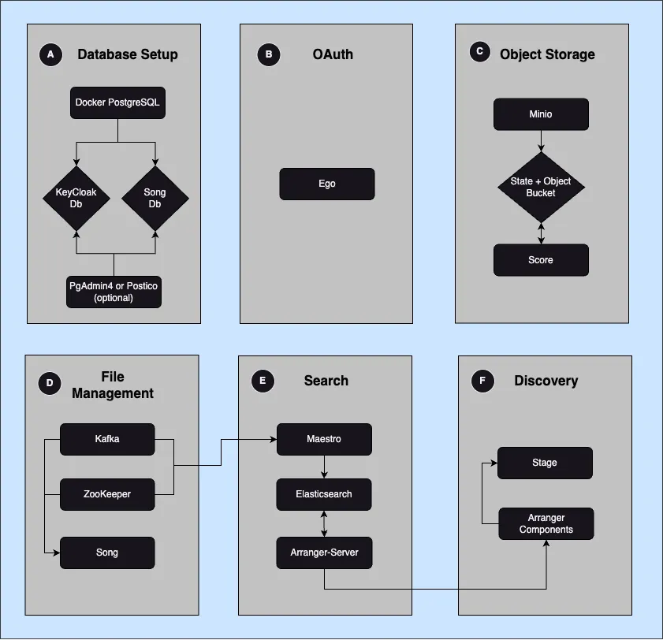

# Overture Composer

## Goal

The Overture Composer will have its own repository, enabling users to run the following three commands.

```bahs
git clone https://github.com/overture-stack/overtureComposer \
chmod +x composer.sh
./composer.sh
```

See here for reference to cBioPortal Docker Compose: https://github.com/cBioPortal/cbioportal-docker-compose.

## Justification

A way to look at it (Overture Demo Portal), A way to try it out (Overture Composer) and a way to own it (Individual Microservices).

- The Overture Demo Portal serves as a new user's first point of contact. With a point-and-click from our landing page, prospective users can easily see what an Overture data platform looks like, effectively communicating whether it meets their desired use case.

- The Overture Composer will enable interested users to gain hands-on experience using Overture services. This resource will be foundational for our training guides, tutorials, and workshops.

## Outline of Requirements

| **Will not include** | **Rational**                                                                                          |
| -------------------- | ----------------------------------------------------------------------------------------------------- |
| Visualization tools  | Further development is required to deploy Overture services with the Jbrowse Stage branch seamlessly  |
| SSI configuration    | We cannot automate SSI integration (i.e. Google). This must be done through the Google Cloud console. |

| **Will include** | **Rational**                                                                                                                                                                                                                                                                              |
| ---------------- | ----------------------------------------------------------------------------------------------------------------------------------------------------------------------------------------------------------------------------------------------------------------------------------------- |
| Mock data        | Having mock data removes the need/requirement of the user to launch the service and do the myriad of data configuration steps (register schema, create index mapping, configure arranger components, etc). One standard data model and data set will make the platform more reproducible. |

## Setup Overview

I’ve split the implementation into six somewhat arbitrary segments.

 

Implementation Overview
The following table summarizes the progress so far:

| **Requirement**                                   | **Status** | **Notes**                                                                                                                                                              |
| ------------------------------------------------- | ---------- | ---------------------------------------------------------------------------------------------------------------------------------------------------------------------- |
| Database Setup                                    | Drafted    | Can we seed data directly into Song and Ego's databases?                                                                                                               |
| Object Storage (MinIO)                            | Drafted    | If we pre-seed the songs database, then we would need to have matching data within the local MinIO data folder. Need to figure out how to get this data folder working |
| OAuth (Ego or KeyCloak)                           | To Do      | Which service allows us to automate setup more easily?                                                                                                                 |
| File Management (Song & Score)                    | Drafted    | Alternatively, can we script CURL commands to automate data uploads?                                                                                                   |
| Search (Elasticsearch, Maestro & Arranger-server) | To Do      | Can we pre-configure the index mapping steps if we know the data we are spinning the platform up?                                                                      |
| Discovery (Stage, Arranger Components)            | To Do      | Should be able to pre-configure the arranger configs                                                                                                                   |
